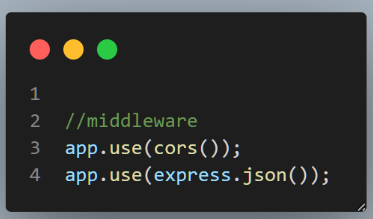
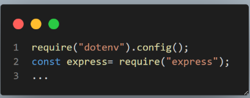

# Server Side at Vercel

## Step-1-:- comment all await commands before deployment

তোমার সার্ভার সাইডের কোডের নিচের কমান্ড গুলো কে কমেন্ট / ডিলিট করে দাও।  
 await client.connect();
await client.db("admin").command({ ping: 1 });
await client.close();

## Step-2:- add vercel.json

তোমার সার্ভার প্রজেক্টে vercel.json নামে একটা ফাইল ক্রিয়েট করে ফেলো। এবং সেখানে নিচের এই জেসন টা এড করে দাও।

{ "version": 2, "builds": [ { "src": "index.js", "use": "@vercel/node" } ], "routes": [ { "src": "/(.\*)", "dest": "index.js", "methods": [ "GET", "POST", "PUT", "PATCH", "DELETE", "OPTIONS" ] } ] }

## Step-3:- Confirm that you use these Middleware

ভালো করে চেক করে দেখো যে তুমি CORS কে ইন্সটল করেছো কিনা এবং CORS Middleware ব্যবহার করছো কিনা
চেক করে দেখো যে তুমি express.json কে middleware হিসেবে ব্যবহার করছো কিনা।

## Step-4:- confirm that you used dotenv at the top
চেক করে দেখো dotEnv ইন্সটল করেছো কিনা এবং dotenv  কে একদম সবার উপরে ব্যবহার করছো কিনা।  না করলে একে সবার উপরে নিয়ে যাও। 

## Step-5:- deploy with CLI 
তোমার কম্পিউটারে গ্লোবালী  Vercel CLI ইনস্টল করো । ইন্সটল করা থাকলে এই ধাপ টি স্কিপ করতে পারো। 
npm install -g vercel

## Step-6: vercel login

and deploy:  vercel--prod

